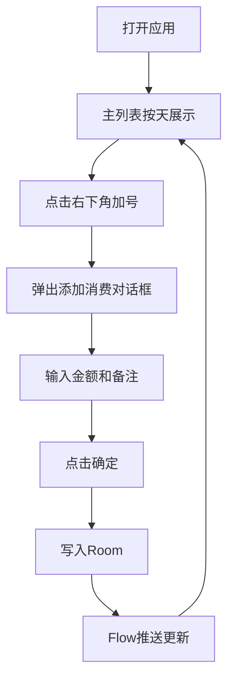

# ExpenseTracker 架构设计文档

## 1. 目标与范围

本方案仅覆盖安卓记账 App 的最小可行版本，严格控制在小应用粒度：

- 单 Activity 架构
- 单主屏
- 启动后展示消费列表，按天分组并展示当日总花费
- 右下角提供加号 FAB，点击后添加一笔消费
- 添加消费只包含两个输入项：金额、备注
- UI 风格统一使用 Material Design 3
- 不设计额外功能，不扩展预算、分类、统计报表、多账户等能力

## 2. 技术栈

| 层次 | 选型 |
|---|---|
| 开发语言 | Kotlin |
| UI 框架 | Jetpack Compose |
| 设计系统 | Material Design 3 |
| 本地存储 | Room |
| 架构模式 | MVVM |

## 3. 项目结构设计

固定包名：`com.example.expensetracker`

```text
com.example.expensetracker
├── MainActivity                         // 应用唯一 Activity，承载主界面
├── data
│   ├── local
│   │   ├── ExpenseEntity               // Room Entity
│   │   ├── ExpenseDao                  // Room DAO
│   │   └── ExpenseDatabase             // Room Database
│   └── ExpenseRepository               // 数据访问薄封装
├── ui
│   ├── screen
│   │   └── ExpenseListScreen           // 主列表页
│   ├── component
│   │   └── AddExpenseDialog            // 添加消费对话框
│   ├── model
│   │   └── DailyExpenseUiModel         // 按天汇总展示模型
│   └── viewmodel
│       └── ExpenseViewModel            // 状态管理与交互入口
└── theme                               // Material 3 主题配置
```

设计说明：

- 采用单 Activity + Compose 导航最小化策略，当前仅单主屏，无多页面导航负担
- Repository 保持薄层，只做 DAO 调用转发，避免过度设计
- ViewModel 负责 UI 状态聚合与输入校验

## 4. 数据模型设计

### 4.1 Room Entity 字段设计

表名：`expenses`

| 字段名 | 类型 | 约束 | 说明 |
|---|---|---|---|
| id | Long | 主键，自增 | 消费记录唯一标识 |
| amountCent | Long | 非空 | 金额，单位为分，避免浮点误差 |
| note | String | 非空，默认空字符串 | 备注 |
| createdAtEpochMillis | Long | 非空 | 创建时间戳，毫秒 |

### 4.2 UI 汇总模型

`DailyExpenseUiModel` 字段建议：

- date：当天日期
- totalAmountCent：当天总金额，单位分
- items：当日消费明细列表

### 4.3 按天汇总策略

- DAO 提供按创建时间倒序的消费流
- ViewModel 将时间戳按本地时区映射为日期后进行分组
- 每组计算当日总额并生成 `DailyExpenseUiModel` 供界面渲染

## 5. 主要界面与交互

### 5.1 主列表页

核心要点：

- 顶部使用 M3 TopAppBar
- 主体使用 LazyColumn 展示按天分组数据
- 每个分组头展示 日期 + 当天总花费
- 分组内每条记录展示 备注 + 金额
- 空数据时展示居中空状态文案
- 右下角使用 M3 FAB，点击弹出添加消费对话框

### 5.2 添加消费对话框

输入与校验：

- 金额：必填，十进制输入，仅接受合法正数
- 备注：可选，允许为空
- 确定按钮仅在金额合法时可用
- 点击确定后写入 Room 并关闭对话框
- 点击取消直接关闭，不写入数据

### 5.3 交互流程



## 6. 关键依赖清单

| 组件 | 版本 | 说明 |
|---|---|---|
| Kotlin | 2.0.21 | 开发语言 |
| Compose BOM | 2024.12.01 | Compose 依赖版本对齐 |
| androidx.compose.material3:material3 | 跟随 BOM 2024.12.01 | Material 3 组件 |
| androidx.activity:activity-compose | 1.9.3 | Activity 与 Compose 集成 |
| androidx.lifecycle:lifecycle-runtime-compose | 2.8.7 | Compose 生命周期集成 |
| androidx.lifecycle:lifecycle-viewmodel-compose | 2.8.7 | ViewModel 与 Compose 集成 |
| androidx.room:room-runtime | 2.6.1 | Room 运行时 |
| androidx.room:room-ktx | 2.6.1 | Room Kotlin 扩展 |
| androidx.room:room-compiler | 2.6.1 | Room 注解处理 |
| com.google.devtools.ksp | 2.0.21-1.0.28 | KSP 插件 |

## 7. Gradle 关键配置

关键配置项如下：

- namespace：`com.example.expensetracker`
- compileSdk：35
- minSdk：26
- targetSdk：35
- Java 版本：17
  - sourceCompatibility = JavaVersion.VERSION_17
  - targetCompatibility = JavaVersion.VERSION_17
- Kotlin 版本：2.0.21
  - jvmTarget = 17
- 启用 Compose：buildFeatures.compose = true
- 关键插件：
  - com.android.application
  - org.jetbrains.kotlin.android
  - org.jetbrains.kotlin.plugin.compose
  - com.google.devtools.ksp

---

该设计满足小应用范围要求，保持单 Activity、单主屏与最小可行架构，聚焦 记一笔消费 与 按天查看总花费 两个核心能力。
